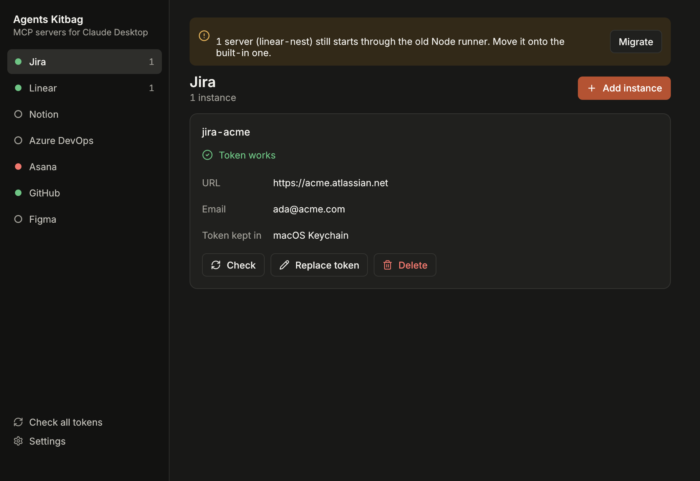

# Agents Kitbag

What your AI assistants are equipped with, set up from one window. Today that
is MCP servers for Claude Desktop, Claude Code and Codex: Jira, Linear, Notion,
Azure DevOps, Asana, GitHub and Figma, each with its token kept out of the
config and checked that it still works. A native app for macOS, Windows and Linux, written in Rust on
egui and [fastframe](https://github.com/crmne/fastframe).

<picture>
  <source media="(prefers-color-scheme: light)" srcset="docs/screenshots/window-light.png">
  
</picture>

A rail on the left holds the sections (MCP servers today) and the settings.
Beside it, the integrations are listed with a mark for the state of their tokens. The
pane beside it shows each configured server, where its token is kept and
whether it still works, and the form that sets one up.

## Install

Download the package for your system from the
[latest release](https://github.com/jetrockets/agents-kitbag/releases/latest).
The app updates itself from then on.

**macOS.** Open `agents-kitbag-v<version>-macos-universal.dmg` and drag Agents Kitbag to
Applications. The app is not signed with an Apple Developer ID yet,
so the first time: right-click it, Open, Open. Run it from Applications, not
from the disk image: servers with a stored token are started through a program
inside the app, and the config points at it.

**Windows.** Unpack `agents-kitbag-v<version>-x86_64-pc-windows-msvc.zip` into
a folder that will stay, and run `agents-kitbag.exe`. SmartScreen will ask the
first time: More info, Run anyway.

**Linux.** Unpack `agents-kitbag-v<version>-x86_64-unknown-linux-gnu.tar.gz`
and run `./install.sh`. It puts the app in `~/.local/share/agents-kitbag` and
in the applications menu.

The MCP servers themselves need [Node.js](https://nodejs.org/) (`npx`), and
Jira's needs [uv](https://docs.astral.sh/uv/) (`uvx`). The app says so when
one is missing.

## Assistants

The list at the top of the window chooses whose servers are shown. Each
assistant has servers, tokens and backups of its own.

| Assistant | Where its servers are | Takes a change in |
|---|---|---|
| Claude Desktop | `claude_desktop_config.json` in its own folder | when it restarts |
| Claude Code | `mcpServers` in `~/.claude.json` (every project) | in a new session |
| Codex | `[mcp_servers]` in `~/.codex/config.toml` | in a new session |

Everything else in those files is left as it was, comments in the TOML
included. `CLAUDE_CONFIG_DIR` and `CODEX_HOME` are followed when the app's own
environment has them. Checked on macOS with the real `claude` and `codex`
reading files the app wrote; on Windows and Linux this is covered by tests
only.

## Integrations

| Integration | Sign-in | Several at once | MCP server |
|-------------|---------|-----------------|------------|
| **Jira** | Email and API token | Yes (`jira-<name>`) | [mcp-atlassian](https://github.com/sooperset/mcp-atlassian) |
| **Linear** | API key, one per workspace | Yes (`linear-<name>`) | [Linear's own](https://linear.app/docs/mcp) (`mcp.linear.app`) |
| **Notion** | Access token, one per workspace | Yes (`notion-<name>`) | [Notion's own](https://github.com/makenotion/notion-mcp-server) |
| **Azure DevOps** | Microsoft login in the browser, on first use | Yes (`ado-<name>`) | [Microsoft's own](https://github.com/microsoft/azure-devops-mcp) |
| **Asana** | Personal access token | No (one token reaches every workspace) | [mcp-server-asana](https://github.com/roychri/mcp-server-asana) |
| **GitHub** | The GitHub CLI (`gh`) | No | [GitHub's own](https://github.com/github/github-mcp-server) (`api.githubcopilot.com`) |
| **Figma** | Personal access token | No | [figma-developer-mcp](https://github.com/GLips/Figma-Context-MCP) |

Each token is checked against its service when you save it and again every
time the app starts.

## Where a token is kept

Claude Desktop passes an MCP server's `env` through as it is, with no variable
expansion, so a token can only stay out of `claude_desktop_config.json` if a
wrapper fetches it when the server starts. The form asks where to keep each
one and offers only what works on your machine:

| Choice | Where the secret lives |
|---|---|
| **GitHub CLI** | Nowhere new: `gh` already has it (GitHub only) |
| **System credential store** | macOS Keychain, Windows DPAPI, or the Secret Service on Linux |
| **1Password** | Your vault, when the `op` CLI can reach it |
| **Config file** | The config, in plain text |

A store that refuses a token is an error in the form. Nothing falls back to
plain text on its own.

### The system credential store

The server is started through `agents-kitbag-runner`, which sits beside the
app, reads the secret and hands it to the server:

```jsonc
{
  "command": "/Applications/Agents Kitbag.app/Contents/MacOS/agents-kitbag-runner",
  "args": ["--secret", "ASANA_ACCESS_TOKEN=keychain:agents-kitbag-asana",
           "--", "npx", "-y", "@roychri/mcp-server-asana@beta"],
  "env": {}
}
```

References are `keychain:` (macOS `security`), `dpapi:` (a DPAPI-encrypted file
under `%APPDATA%\agents-kitbag\secrets`, readable only by that user on that
machine), `libsecret:` (Linux `secret-tool`) and `gh:` (asks the GitHub CLI,
stores nothing). Secrets are written through stdin, never as command
arguments, which any process on the machine can read. The store's own programs
are called by absolute path, since an app started from the Dock or the Start
menu only gets the bare system `PATH`.

### 1Password

The server is started through `op run`, which resolves the reference:

```jsonc
{
  "command": "/opt/homebrew/bin/op",
  "args": ["run", "--no-masking", "--", "npx", "-y", "@roychri/mcp-server-asana@beta"],
  "env": { "ASANA_ACCESS_TOKEN": "op://Private/Agents Kitbag - asana/credential" }
}
```

- Turn on 1Password, Settings, Developer, *Integrate with 1Password CLI*.
- `--no-masking` is required: `op run` conceals secrets it finds on stdout,
  and stdout is the server's JSON-RPC transport.
- A locked 1Password stops the server from starting. The app reports that as
  locked, not as a missing token.

### Tokens that travel in a header

GitHub and Linear send their token in an `Authorization` header rather than
`env`. The header carries a `${VAR}` placeholder, which `mcp-remote` expands
from the environment the wrapper supplies.

## What else it does

- **Changes only its own servers.** Everything else in the config is left as
  it was, in the order it was in, and the config is copied before each change
  (Settings can delete those copies: they hold whatever the config held).
- **Leaves a config it cannot read alone.** A file that is not valid JSON is
  reported, never overwritten.
- **Restarts Claude Desktop when you click Restart** (macOS). On Windows and
  Linux it says how.
- **On Windows, keeps the config read-only**, because the packaged Claude
  Desktop otherwise drops its MCP servers on restart, and installs npm
  servers globally so they start within Claude Desktop's 60 seconds.
- **Moves older setups along.** Servers that start through
  `node .../secret-runner.js` (written by the Node.js toolkit this app
  replaced) keep working, and the app offers to move them onto its own runner.
- **Writes a log** of what it did, without tokens (Settings, Open the log
  folder).

## Skills

Claude Code skills for project managers: developer-ready issues from business
requirements.

| Skill | What it does |
|-------|--------------|
| [Jira Task Creator](skills/jira-task-creator-from-descriptions-as-a-project-manager/) | Analyzes GitHub repos, creates Jira issues |
| [Linear Task Creator](skills/linear-task-creator-from-descriptions-as-a-project-manager/) | Analyzes GitHub repos, creates Linear issues |
| [Asana Task Creator](skills/asana-task-creator-from-descriptions-as-a-project-manager/) | Analyzes GitHub repos, creates Asana tasks |
| [GitHub Task Creator](skills/github-task-creator-from-descriptions-as-a-project-manager/) | Analyzes GitHub repos, creates GitHub issues in Projects |
| [Azure + Linear Task Creator](skills/azure-linear-task-creator-from-descriptions-as-a-project-manager/) | Analyzes Azure DevOps repos, creates Linear issues |

## Build from source

```bash
cargo run -p agents-kitbag-app -- --demo   # made-up servers, nothing sent or stored
cargo run -p agents-kitbag-app             # your real Claude Desktop config
```

Three crates: `agents-kitbag-core` (the config, the stores, the integrations and
their checks, with no window), `agents-kitbag-app` (the window) and `agents-kitbag-runner`
(the program that starts a server with its token). See [AGENTS.md](AGENTS.md)
for the architecture, the checks and how a release is made.

## License

[MIT](LICENSE). Copyright © 2026 JetRockets.
